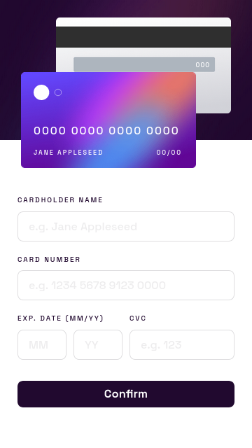
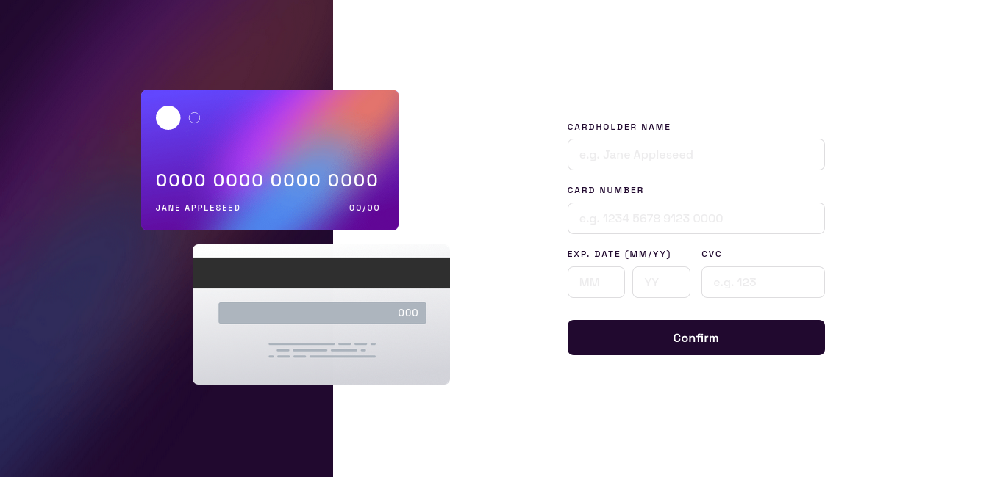

# Frontend Mentor - Solución de formulario de detalles de tarjeta interactiva

Esta es una solución al [desafío de formulario de detalles de tarjeta interactiva en Frontend Mentor](https://www.frontendmentor.io/challenges/interactive-card-details-form-XpS8cKZDWw). Los desafíos de Frontend Mentor te ayudan a mejorar tus habilidades de codificación mediante la creación de proyectos realistas.

## Índice

- [Frontend Mentor - Solución de formulario de detalles de tarjeta interactiva](#frontend-mentor---solución-de-formulario-de-detalles-de-tarjeta-interactiva)
  - [Índice](#índice)
  - [Descripción general](#descripción-general)
    - [El desafío](#el-desafío)
    - [Captura de pantalla](#captura-de-pantalla)
      - [Diseño Movil](#diseño-movil)
      - [Diseño Escritorio](#diseño-escritorio)
    - [Enlaces](#enlaces)
  - [Mi proceso](#mi-proceso)
    - [Creado con](#creado-con)
    - [Lo que aprendí](#lo-que-aprendí)
    - [Recursos útiles](#recursos-útiles)
  - [Autor](#autor)

**Nota: elimine esta nota y actualice el índice en función de las secciones que conserve.**

## Descripción general

### El desafío

Los usuarios deberían poder:

- Completar el formulario y ver cómo se actualizan los detalles de la tarjeta en tiempo real
- Recibir mensajes de error cuando se envía el formulario si:
- Algún campo de entrada está vacío
- El número de tarjeta, la fecha de vencimiento o los campos CVC tienen un formato incorrecto
- Ver el diseño óptimo según el tamaño de la pantalla de su dispositivo
- Ver los estados de desplazamiento, activo y de enfoque de los elementos interactivos en la página

### Captura de pantalla

#### Diseño Movil


#### Diseño Escritorio


### Enlaces

- URL de la solución: [GitHub](https://github.com/jean266/formulario_tarjeta_bancaria)
- URL del sitio en vivo: [Vercel](https://formulario-tarjeta-bancaria.vercel.app/)

## Mi proceso

### Creado con

- Marcado HTML5 semántico
- Propiedades personalizadas de CSS
- Flexbox
- Cuadrícula CSS
- Flujo de trabajo para dispositivos móviles
- Gulp
- SASS

### Lo que aprendí

```html
<h1>Algunos códigos HTML del que estoy orgulloso</h1>
```
```css
.proud-of-this-css {
color: papayawhip;
}
```
```js
const proudOfThisFunc = () => {
console.log('🎉')
}
```

### Recursos útiles

- [Recurso de ejemplo 1](https://www.example.com): esto me ayudó por XYZ. Me gustó mucho este patrón y lo usaré en el futuro.


## Autor

- Mentor de frontend: [@jean266](https://www.frontendmentor.io/profile/jean266)
- Twitter: [@yourusername](https://www.twitter.com/)

